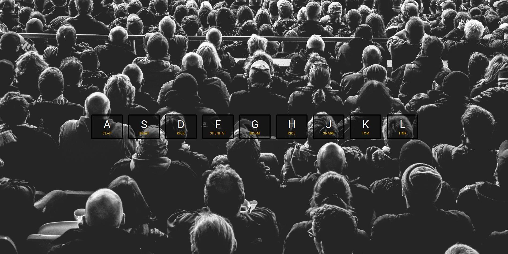

# JavaScript Drum Kit
This is a implementation of the first challenge of the [30 day vanilla js coding challenge](https://projectlearn.io/learn/web-development/project/javascript30---30-day-vanilla-js-coding-challenge-170). It is a web application that plays drum sound when the corresponding key is pressed.

Key takeaways:
- `data-*` attribute: This is a custom attribute that can be added to any HTML element. It is used to store custom data private to the page or application. The attribute name should be in lowercase with no uppercase letters. The attribute value can be any string. (Source: [MDN](https://developer.mozilla.org/en-US/docs/Learn/HTML/Howto/Use_data_attributes))
- JavaScript's `function` and `addEventListener` method: The `function` method is used to define a function. The `addEventListener` method is used to add an event listener to the specified element. (Source: [W3Schools](https://www.w3schools.com/js/js_functions.asp), [W3Schools](https://www.w3schools.com/jsref/met_element_addeventlistener.asp))
- The `keydown` event: The `keydown` event is fired when a key is pressed. (Source: [W3Schools](https://www.w3schools.com/jsref/event_onkeydown.asp))
- Interactions between CSS and JavaScript: The `document` object has two child nodes: `document.doctype` and `document.documentElement`. More detail can be found at this [Segment Fault](https://segmentfault.com/a/1190000000660947) page (in Simplified Chinese).
- The meaning of input `e` of the JavaScript function: The `e` is the event object (Just a common notation). It contains information about the event that triggered the function. (Source: [W3Schools](https://www.w3schools.com/jsref/event_key_keycode.asp))
- JavaScript's `window` variable: The `window` variable represents the browser's window. (Source: [W3Schools](https://www.w3schools.com/js/js_window.asp))