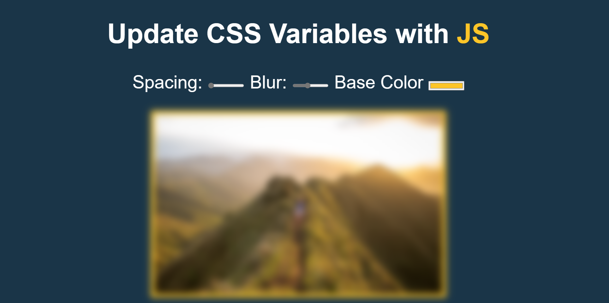

# CSS Varaibles
This is a simple project to integrate JavaScripts that uses CSS variables to change the spacing, blur, and color of an image.

Key takeaways:
- CSS variables can be used to store values that can be reused throughout the stylesheet.
- `addEventListener()` can be used to listen to events on a DOM element. Combining with `change` event, we can listen to changes on the input element.