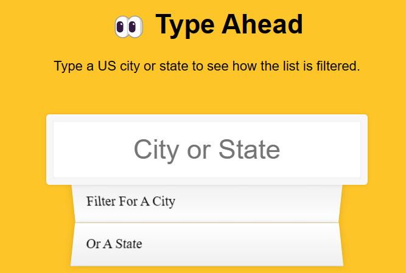
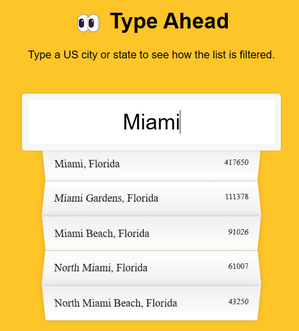

# Type Ahead
This challenge is about using the fetch API to retrieve data from a server and display it in a list. The data is a list of cities and states in the US. The user can type in a city or state and the list will be filtered to show only the cities or states that match the user's input.

Key Takeaways:
- `...` is the spread operator. It takes an iterable (like an array) and expands it into individual elements. In this case, it is used to create an array of cities and states from the JSON data. Source: [MDN](https://developer.mozilla.org/en-US/docs/Web/JavaScript/Reference/Operators/Spread_syntax)
- `fetch()` is a method that returns a promise. The promise resolves to a response object. The response object has a method called `json()` that returns a promise. The promise resolves to the JSON data. Source: [MDN](https://developer.mozilla.org/en-US/docs/Web/API/Fetch_API/Using_Fetch)
- `then()` is a method that takes a callback function as an argument. The callback function is executed when the promise resolves. Source: [MDN](https://developer.mozilla.org/en-US/docs/Web/JavaScript/Reference/Global_Objects/Promise/then)
- In order to parse the JSON data, the `json()` method must be called on the response object. The `json()` method returns a promise that resolves to the JSON data. Source: [MDN](https://developer.mozilla.org/en-US/docs/Web/API/Body/json)
- While declaring `const` property of a list, you can still change the values of the list. You just can't reassign the list to a different value. For instance, the `pop()` and `push()` methods can still be used to change the values of the list. Source: [MDN](https://developer.mozilla.org/en-US/docs/Web/JavaScript/Reference/Statements/const)
- `gi` is a regular expression flag that stands for global and case insensitive. It is used to search for a pattern in a string. Source: [MDN](https://developer.mozilla.org/en-US/docs/Web/JavaScript/Guide/Regular_Expressions)
- When doing frontend development, always ensure the functionality works, then worry about styling. This is because styling can be time consuming and it is easier to style something that already works than to debug something that doesn't work.