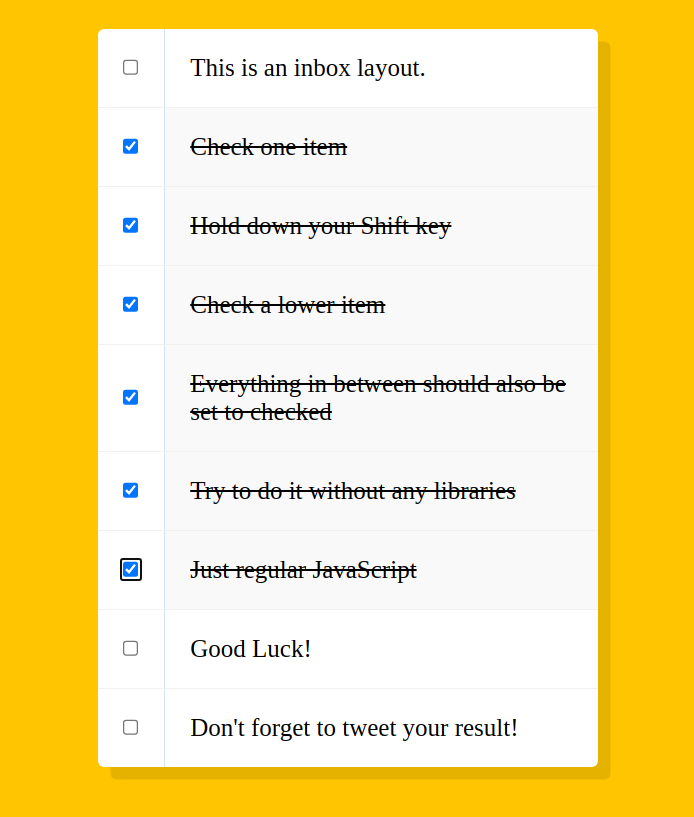

# Hold Shift and Check Checkboxes
This is a script that allows the user to check multiple checkboxes by holding down the shift key and clicking on the first and last checkboxes. 

Key Takeaways:
- The `querySelectorAll()` method returns a static NodeList of all elements in the document that match a specified CSS selector(s). The NodeList object represents a collection of nodes. The nodes can be accessed by index numbers. The index starts at 0.
- `forEach()` is a method that executes a provided function once for each element in an array.
- `shiftKey` is a read-only Boolean property of the KeyboardEvent interface. It indicates whether the shift key was pressed (`true`) or not (`false`) when the event occurred.
- Similarily, `ctrlKey` is a read-only Boolean property of the KeyboardEvent interface. It indicates whether the control key was pressed (`true`) or not (`false`) when the event occurred.