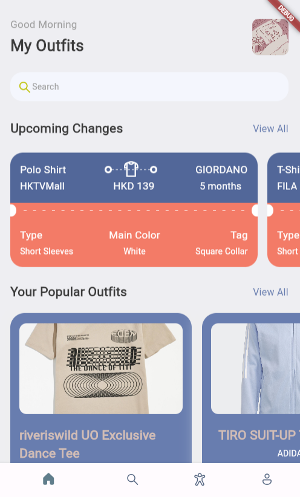
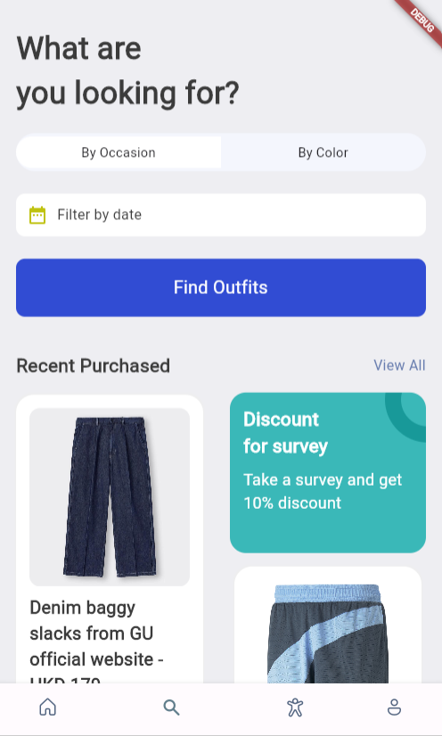
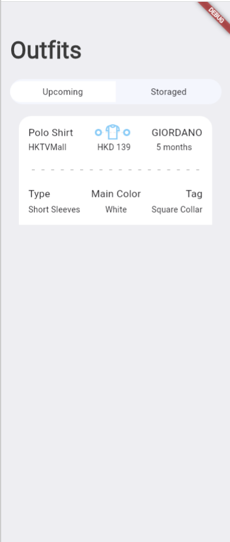
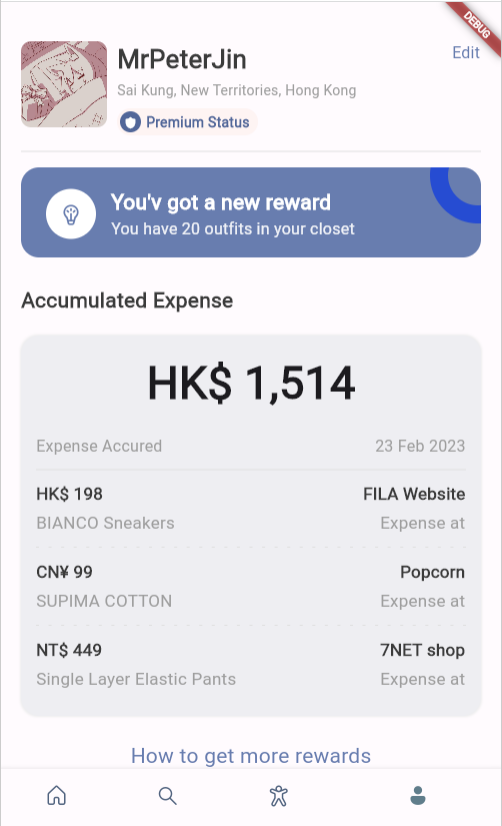

# My Outfits

A learn-by-doing flutter project, aimming at building a outfit managment system of MrPeterJin (or someone else). Due to the high capacity of MrPeterJin's academic load, this project may or may not be completed and have the possibility of infinitly halt at some point.

## Getting Started
Firstly, you may follow the [Flutter](https://docs.flutter.dev/get-started/install) website to install the framework.

For the code at this very first stage, you may:
```
git clone https://github.com/MrPeterJin/my_outfits.git
```
and observe the whole framework, or try to complie by yourself. Since I am still learning this framework, I cannot produce the complied version of this software at this time.

## Records as present
Stage 1: Basic Framework (Completed on Feb. 14, 2023)                  
Stage 2: Static Information with Each Section
- Main Page (Completed on Feb. 18, 2023)
- Search Page (Completed on Feb. 21, 2023)
- Profile Page (Completed on Feb. 23, 2023)
- Outfit Page (Completed on May. 27, 2023)

Detailed development records are in the [records](./records/) folder. The application successfully runs on Android, Linux, and web (Chrome).

The screenshot of the main page is displayed below: 

| Main Page | Search Page | Outfit Page | Profile Page |
| :---: | :---: | :---: | :---: |
|  |  |  |  |

Due to lack of the frontend knowledge, I would like to stop the development of this project at this point. However, I will continue to learn the basics of fullstack, and I *may* will come back to this project in the future.

## Credits
The following lists the references I refer to during the learning of Flutter framework.
- [Flutter docs](https://api.flutter.dev/index.html)
- [Flutter 3.3 Master Class for Beginners to Advanced | Ticket Booking App Development Tutorial](https://www.youtube.com/watch?v=71AsYo2q_0Y)
